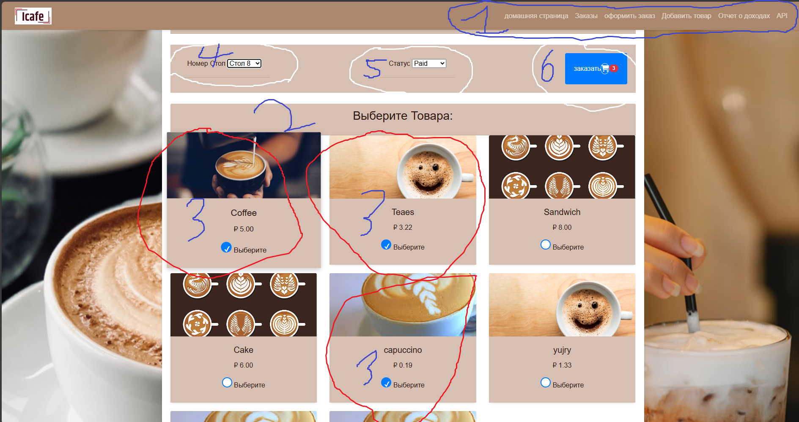
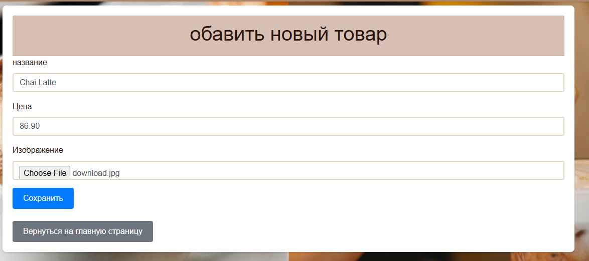
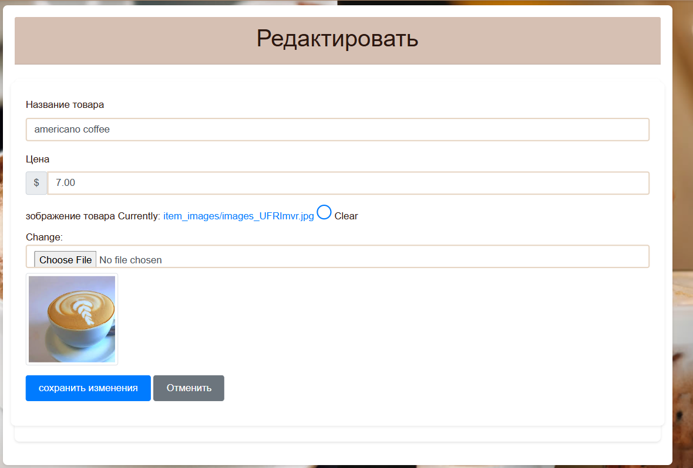
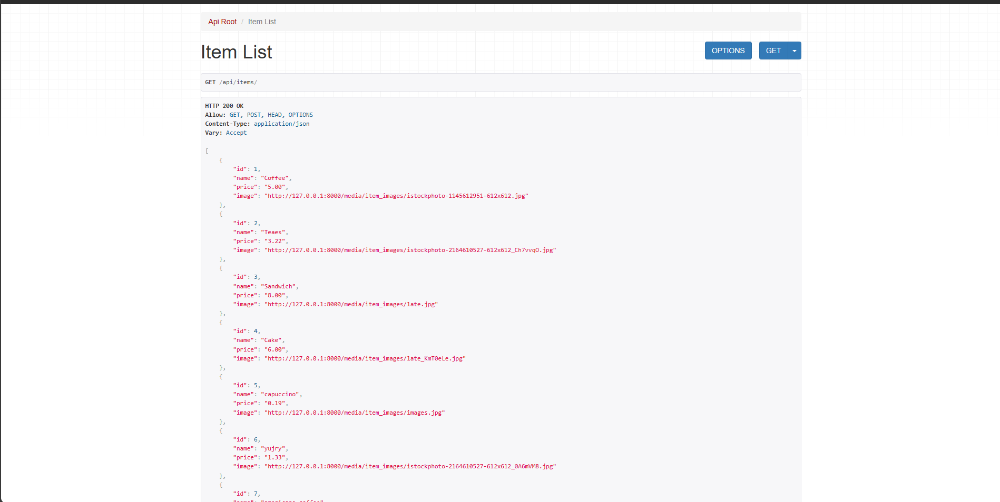
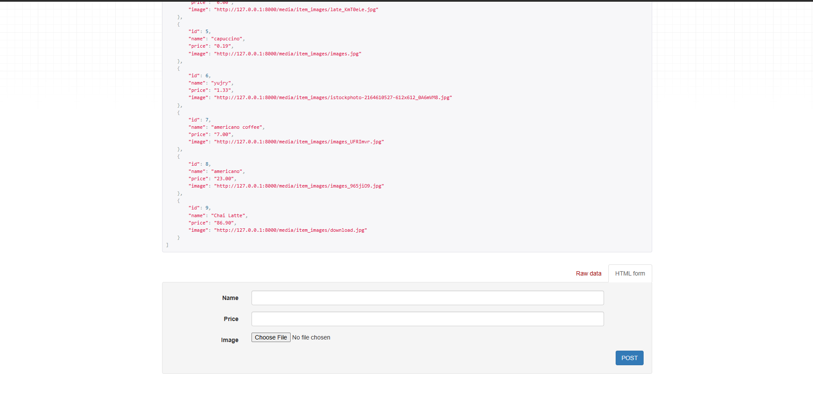
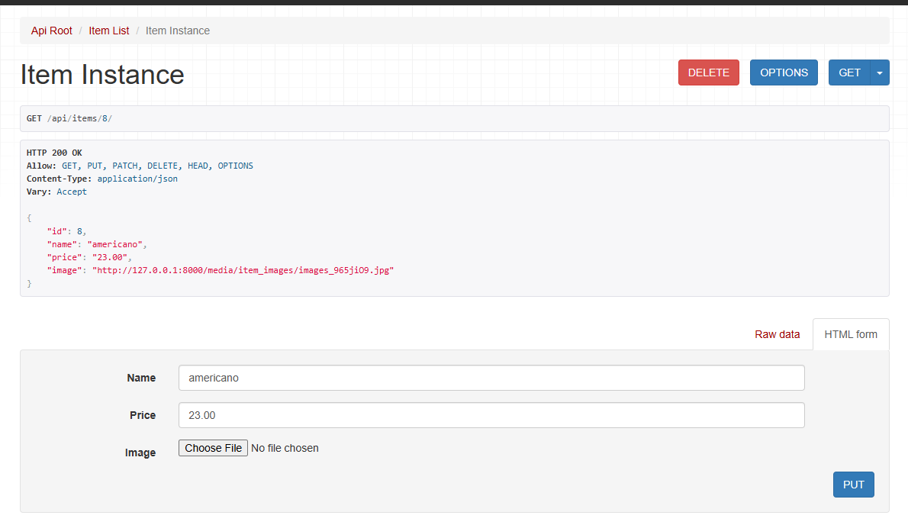
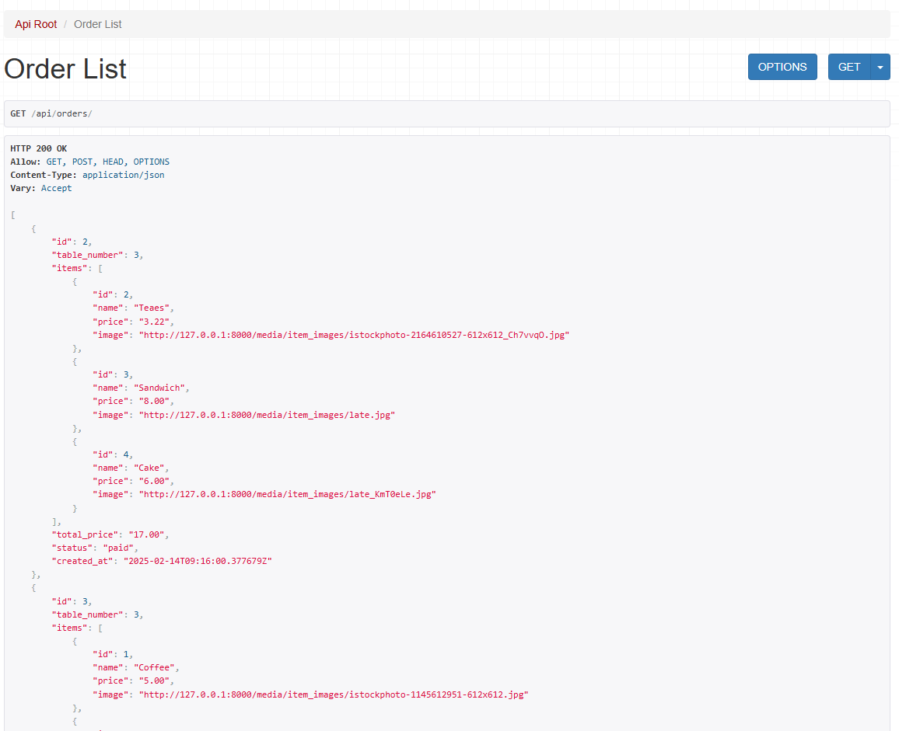
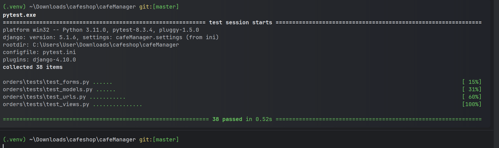

# Cafe Order Management System

A Django-based web application to manage cafe orders.

## Features
## Key Features
- **Menu Management**
  - Display and manage menu items with prices
  - Add, update, and delete menu items
  - Image support for menu items

- **Order Processing**
  - Create and manage orders
  - Table assignment system
  - Real-time order status tracking (Pending, Ready, Paid)
  - Automated total cost calculation

- **Revenue Management**
  - Track revenue per shift
  - Calculate total revenue across all shifts
  - Generate revenue reports

- **API Integration**
  - RESTful API endpoints for items and orders
  - Seamless third-party integration capabilities

## Installation

### Prerequisites
- Python 3.x
- pip package manager
## Setup
1. create a virtual environment in a any folder of you choosing.
   ```bash
    pip install virtualenv
   
   ## for windows 
   
      python -m venv .venv
      .\.venv\Scripts\activate
   
   ## for linux/mac
      python3 -m venv .venv
      source .venv/bin/activate

   2. Clone the repository.
      ```bash
         git clone https://github.com/Wambong/cafeshop.git 
         cd cafeshop/cafeManager
2. Install dependencies:
   ```bash
   pip install -r requirements.txt

3. Run server:
   ```bash
   python manage.py runserver
   
4. visit the ink below in any browser
   ```bash
   http://127.0.0.1:8000

## Usage

### Web Interface
The system provides an intuitive interface with:
- Navigation bar for easy access to all features
- Interactive menu with item selection
- Table management system
- Order status tracking
- Revenue calculation tools

## From the picture above we see the following features:
1. a navbar for navigation,
2. Menu of items at the cafe
3. checkbox on each product to select,
4. A table number selection dropdown,
5. status selection dropdown
6. placing an order button with a cart icon which also display the number of selected products
## example of placing and order in the picture below.


## the orders page has the following features:
1. Order ID,
2. table number,
3. Product within the order,
4. total cost pey order,
5. status,
6. update status button and delete button.
7. it also has a search by tabe number or status
8. or can filter status.

## Add new product

## update product 

## calculate revenue


## Access the API Endpoints
Since we registered our routes using DefaultRouter() in urls.py, the API endpoints should be:
## for items:
Get all items → http://127.0.0.1:8000/api/items/ 


Get a specific item → http://127.0.0.1:8000/api/items/8/


## Similarly, for orders:

Get all orders → http://127.0.0.1:8000/api/orders/


Get a specific order → http://127.0.0.1:8000/api/orders/14/


## Testing:
 the testing is done on multiple files using pytest including:
1. orders\tests\test_forms.py ...... testing forms                                                                                                         [ 15%]
2. orders\tests\test_models.py ......   testing models                                                                                                     [ 31%]
3. orders\tests\test_urls.py ...........    testing url                                                                                                 [ 60%]
3. orders\tests\test_views.py ............... testing views
## cmd to run the pytest
      ```bash
         pytest
## Result 


## Future Improvements
1. Integration with payment gateways for online ordering
2. Enhanced authentication and authorization system
3. SwaggerUI implementation for API documentation
4. Environment variable configuration using django-environ
5. Mobile application integration
6. real time notification system
