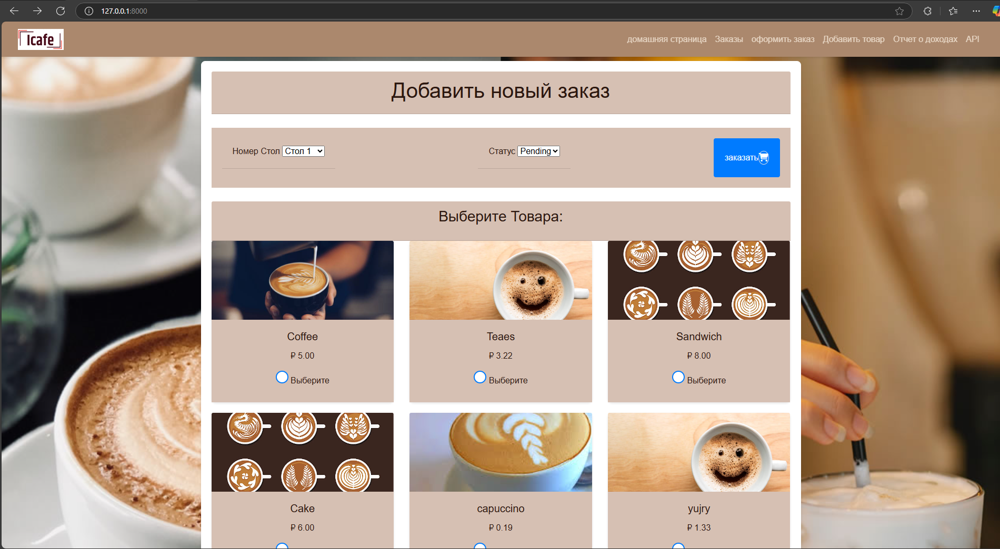
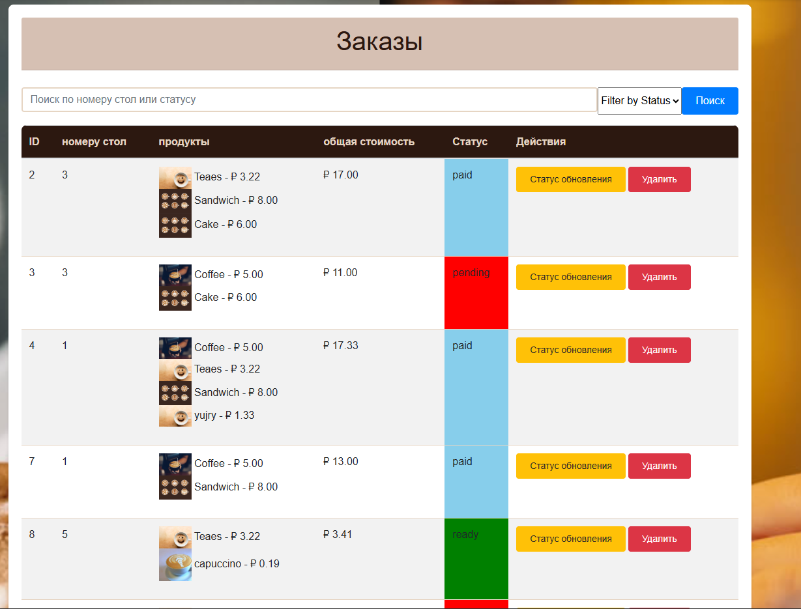
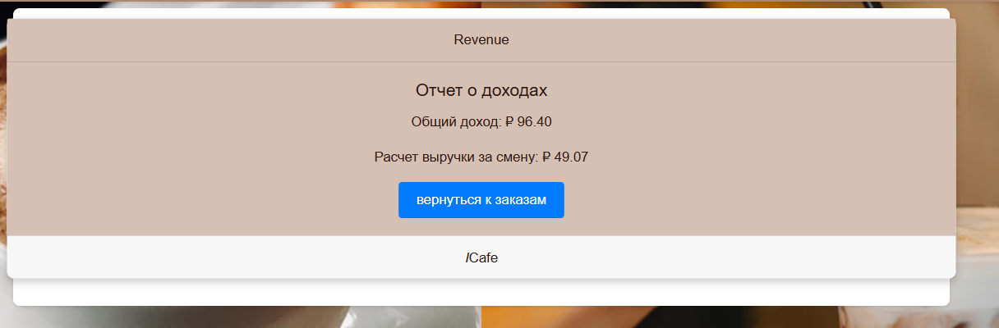
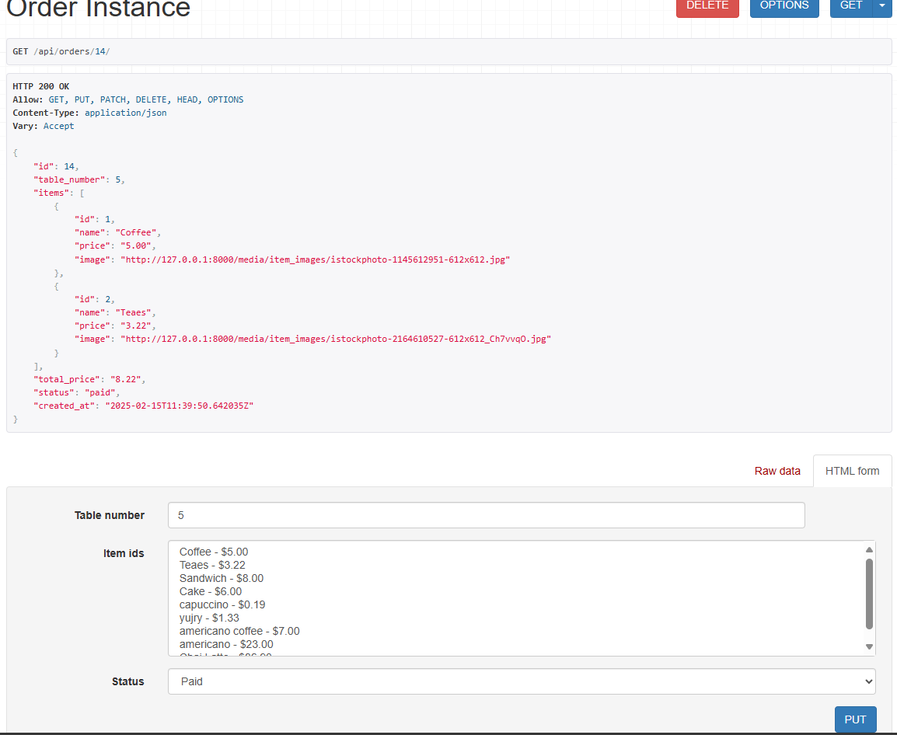

# Система управления заказами кафе

Веб-приложение на основе Django для управления заказами в кафе.

## Функции
## Основные возможности
- **Управление меню**
  - Отображение и управление позициями меню с ценами
  - Добавление, обновление и удаление позиций меню
  - Поддержка изображений для позиций меню

- **Обработка заказов**
  - Создание и управление заказами
  - Система назначения столов
  - Отслеживание статуса заказа в реальном времени (В ожидании, Готов, Оплачен)
  - Автоматический расчет общей стоимости

- **Управление выручкой**
  - Отслеживание выручки за смену
  - Расчет общей выручки по всем сменам
  - Формирование отчетов о выручке

- **Интеграция API**
  - RESTful API endpoints для позиций меню и заказов
  - Возможности бесшовной интеграции со сторонними сервисами

## Установка

### Предварительные требования
- Python 3.x
- Пакетный менеджер pip

## Настройка
1. Создайте виртуальное окружение в любой выбранной вами папке.
   ```bash
    pip install virtualenv
   
   ## для Windows 
   
      python -m venv .venv
      .\.venv\Scripts\activate
   
   ## для Linux/Mac
      python3 -m venv .venv
      source .venv/bin/activate

   2. Клонируйте репозиторий.
      ```bash
         git clone https://github.com/Wambong/cafeshop.git 
         cd cafeshop/cafeManager

2. Установите зависимости:
   ```bash
   pip install -r requirements.txt

3. Запустите сервер:
   ```bash
   python manage.py runserver
   
4. Перейдите по ссылке ниже в любом браузере
   ```bash
   http://127.0.0.1:8000


## Использование

### Веб-интерфейс
Система предоставляет интуитивно понятный интерфейс с:
- Панелью навигации для легкого доступа ко всем функциям
- Интерактивным меню с выбором позиций
- Системой управления столами
- Отслеживанием статуса заказа
- Инструментами расчета выручки

## На изображении выше мы видим следующие функции:
1. Панель навигации
2. Меню позиций кафе
3. Чекбокс на каждом продукте для выбора
4. Выпадающий список для выбора номера стола
5. Выпадающий список для выбора статуса
6. Кнопка размещения заказа с иконкой корзины, которая также показывает количество выбранных продуктов

## Пример размещения заказа на изображении ниже.


## Страница заказов имеет следующие функции:
1. ID заказа
2. Номер стола
3. Продукты в заказе
4. Общая стоимость заказа
5. Статус
6. Кнопка обновления статуса и кнопка удаления
7. Также есть поиск по номеру стола или статусу
8. Возможность фильтрации по статусу


## Добавление нового продукта


## Обновление продукта 


## Расчет выручки


## Доступ к конечным точкам API
Поскольку мы зарегистрировали наши маршруты с помощью DefaultRouter() в urls.py, конечные точки API должны быть:

## Для позиций меню:
Получить все позиции → http://127.0.0.1:8000/api/items/ 


Получить конкретную позицию → http://127.0.0.1:8000/api/items/8/


## Аналогично для заказов:

Получить все заказы → http://127.0.0.1:8000/api/orders/


Получить конкретный заказ → http://127.0.0.1:8000/api/orders/14/


## Тестирование:
Тестирование выполняется в нескольких файлах с использованием pytest, включая:
1. orders\tests\test_forms.py ...... тестирование форм                                                                                                    [ 15%]
2. orders\tests\test_models.py ......   тестирование моделей                                                                                             [ 31%]
3. orders\tests\test_urls.py ...........    тестирование URL                                                                                             [ 60%]
3. orders\tests\test_views.py ............... тестирование представлений

## Команда для запуска pytest
      ```bash
         pytest
## Результат 


## Планируемые улучшения
1. Интеграция с платежными шлюзами для онлайн-заказов
2. Улучшенная система аутентификации и авторизации
3. Внедрение SwaggerUI для документации API
4. Настройка переменных окружения с использованием django-environ
5. Интеграция с мобильным приложением
6. Система уведомлений в реальном времени